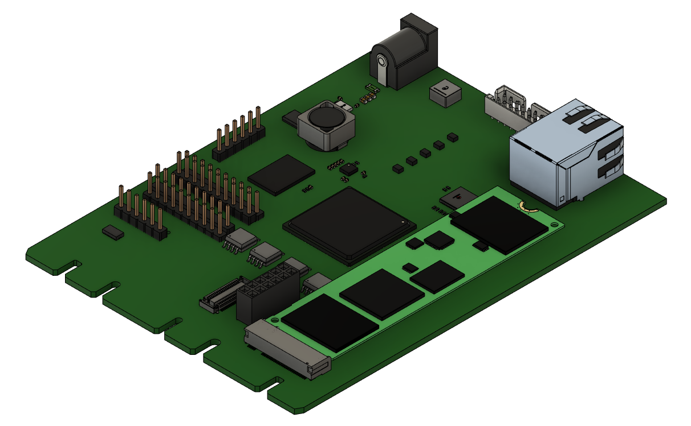

============
Artix DC-SCM
============

Overview
--------

This repository contains design files of the Artix-7 Data Center Secure Control Module (DC-SCM).
The main purpose of this platform is to provide open-source DC-SCM with Baseboard Management Controller (BMC) unit based on Xilinx Artix-7 FPGA family.
The design files were prepared in KiCad.
This design is now a Work in Progress.

Repository structure
--------------------
The main repository directory contains KiCad PCB project files, a LICENSE and README.
The remaining files are stored in the following directories:

* ``lib`` - contains the component libraries
* ``img`` - contains graphics for this README

Key Features
------------

* Artix-7 FPGA - XC7A100T-FGG484
* DC-SCI standard 168-pin 4C+ edge connector
* On-board DDR3 DRAM and eMMC
* QSPI FLASH memory
* Ethernet RJ45 connector with 100BASE-T transciever
* JTAG connector compatible with Xilinx Platform Cable
* M.2 connector with PCIe x1 Gen2 interface
* 13 I2C buses, 4 I3C buses
* dual UART 
* SPI connector
* RoT module connector
* TPM SPI connector
* optional external 12V power input 

Block diagram
-------------

.. figure:: img/diagram.png
