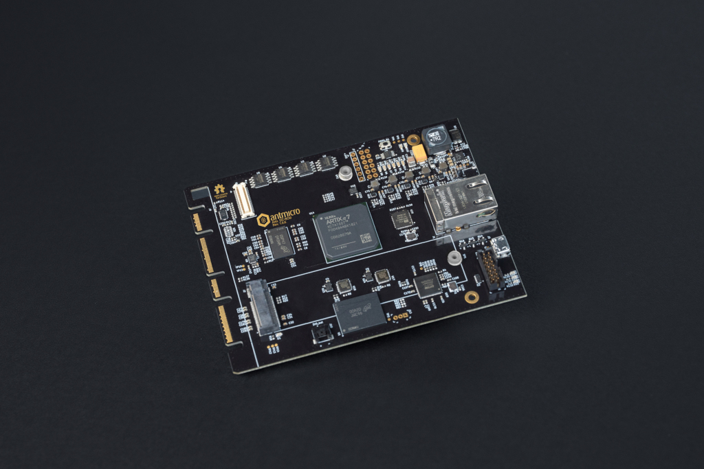

============
Artix DC-SCM
============

Copyright (c) 2020-2021 `Antmicro <https://www.antmicro.com>`_

Overview
--------

This repository contains design files for an open-source Baseboard Management Controller (BMC) module based on the Xilinx Artix-7 FPGA family, designed in accordance with the Data Center Secure Control Module (DC-SCM) specification of Open Compute Project (OCP).
The design files were prepared in KiCad.
This design is complete and now undergoing bringup.

Repository structure
--------------------

The main repository directory contains KiCad PCB project files, a LICENSE and README.
The remaining files are stored in the following directories:

* ``lib`` - contains the component libraries
* ``img`` - contains graphics for this README

Key Features
------------

* Artix-7 FPGA - XC7A100T-FGG484
* DC-SCI standard 168-pin 4C+ edge connector
* On-board DDR3 DRAM (AS4C256M16D3) and eMMC (MTFC16GAPALNA-AIT)
* 4x SPI FLASH memory
* Gigabit Ethernet over KSZ9031RNXCA PHY
* JTAG connector
* Host and client USB (over USB3300-EZK-TR PHY)
* M.2 NVMe interface
* 13x I2C buses, 4x I3C buses
* 2x UART 
* SPI connector
* RoT module connector
* TPM SPI connector

Block diagram
-------------

License
=======

`Apache-2.0 <LICENSE>`_
